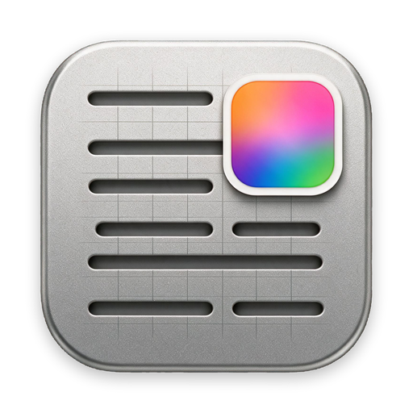
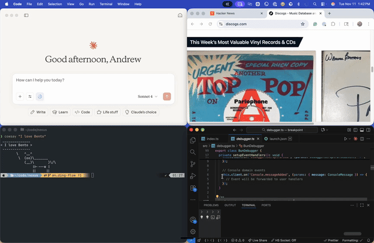
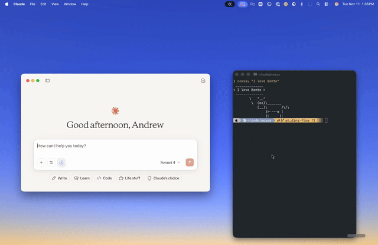
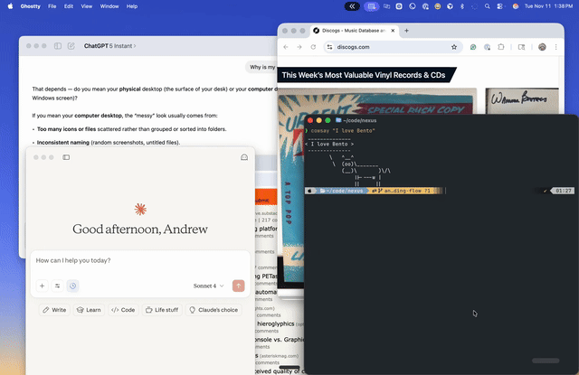

<p align="center">
  
</p>

# DeskJig

Save your window layout as a named workspace. Get it back in one click.

[](LICENSE)
[](https://github.com/HumidResearch/deskjig/releases/latest)

DeskJig is a macOS menu bar app. It records which apps are open, which windows they own, and where each window sits on every monitor. Restore a workspace and each window is unhidden, un-minimized, moved back to its saved frame, and raised in its saved z-order.



DeskJig used to be Bento, a paid app. It is now free and open source. The story of the transition is at [bentodesktop.com](https://bentodesktop.com).

## What it does

- **Workspaces.** One workspace holds every window on every monitor. Save as many as you want, star favorites, restore from the menu bar or the main window.
- **Multi-monitor aware.** Layouts are stored per monitor. If a display from the saved layout is missing at restore time, its windows are grouped as "Unassigned" instead of being dropped.
- **Terminal sessions.** Terminal windows reopen in their saved working directory and reattach to their tmux sessions. The open-in-directory path knows Ghostty, iTerm2, Terminal, kitty, and Alacritty.
- **Chrome profiles and tabs.** Chrome windows reopen under the profile they were saved with, tabs included.
- **Quick switch.** Retargets your terminal and IDE windows at a different project directory without rebuilding the layout by hand.
- **Snap zones.** Drag a window toward the top of the screen and a zone picker drops down. Release over a zone and the window snaps to it.

  

- **Tidy up.** Collects every window into groups, so windows buried under other windows resurface.

  

- **Menu bar window moves.** Move Left, Move Right, Move to Top, Move to Bottom, Center, and Maximize, each on a ⌃⌥ shortcut.
- **A CLI in the bundle.** `deskjig` scripts everything the app can inspect: workspaces, windows, apps, displays, logs. See below.
- **Auto-updates.** Sparkle checks for updates; no account, no server of ours.

## Getting started

### Install

1. Download the DMG from the [latest release](https://github.com/HumidResearch/deskjig/releases/latest).
2. Drag DeskJig to Applications and open it.
3. Grant Accessibility when macOS asks. DeskJig reads and moves windows through the Accessibility API, so nothing works without this grant.

Requires macOS 14 or later.

### Your first workspace

1. Arrange your windows the way you want to find them again.
2. Click the DeskJig icon in the menu bar and choose Open DeskJig.
3. Click "Create new workspace" and save the layout under a name.
4. Mess everything up. Restore the workspace from the menu bar's Workspaces submenu. Your windows go back where they were.

### Coming from Bento

Install DeskJig and launch it. A one-time sweep on first launch adopts the workspaces your Bento install saved, so they show up without any export or import step. macOS will ask for Accessibility again because DeskJig is signed with a new identity. That is the whole migration.

## The command line

The app bundle ships a CLI at `DeskJig.app/Contents/Helpers/deskjig`. Run `deskjig install` to symlink it into `/usr/local/bin`.

```
$ deskjig --help
SUBCOMMANDS:
  workspace               Workspace operations
  url-handoff             Open one or more URLs in Chrome without doing a
                          workspace restore
  window                  Window operations
  app                     App operations (and DeskJig in-app triggers: restore,
                          status, open-url)
  chrome                  Chrome operations
  display                 Display operations
  debug                   Diagnostic and restore debugging operations
  logs                    DeskJig log inspection
  open                    Open a directory in a supported app
  permissions             Check or prompt for Accessibility permissions
  install                 Install a /usr/local/bin/deskjig symlink
  notify                  Show a DeskJig toast notification with optional
                          workspace switch
```

Every command prints a status line, or structured JSON with `--format json`:

```
$ deskjig workspace list
status=success action=list-workspaces exit_code=0 duration_ms=3.66 total_duration_ms=58.13 message="Found 25 workspace(s)"

$ deskjig --format json workspace list
{
  "action" : "list-workspaces",
  "data" : [
    {
      "createdAt" : "2026-01-20T20:24:26Z",
      "icon" : "📊",
      "id" : "2E5A381B-BA32-435C-943A-1E8E3E5D7A75",
      "lastActivatedAt" : "2026-02-07T00:34:39Z",
      "name" : "Data Analysis",
      "screenCount" : 2,
      "windowCount" : 5
    },
    ...
  ]
}
```

Restore a workspace with `deskjig workspace restore "Data Analysis"`, or `deskjig app restore` to run the restore inside the running app. Inspect displays with `deskjig display list`, query windows with `deskjig window query --app Safari`, and move them with `deskjig window move --app Safari --position left-half`.

## Building from source

You need Xcode and [Bun](https://bun.sh).

```bash
bun install
bun run build:app     # DeskJig.app
bun run build:cli     # the deskjig CLI
bun run test          # unit tests
```

The build scripts wrap `xcodebuild`, write logs, and summarize errors. Output lands under `build/`. Release packaging, signing, and notarization are covered in [docs/RELEASING.md](docs/RELEASING.md).

Heads up: the codebase is mid-conversion from its commercial past. You will run into legacy names like `Bento`, `bentoctl`, and `com.mscontrol.bento`. They are tracked for renaming; please don't mass-rename them in a drive-by PR.

## Contributing

Issues and PRs welcome — see [CONTRIBUTING.md](CONTRIBUTING.md) and the [issue tracker](https://github.com/HumidResearch/deskjig/issues). Small PRs, issues first for anything non-trivial. For bug reports, include your macOS version, the app version, and for restore issues the run ID (`restore_HHMMSS_xxxxxx`) from the logs.

Security reports go through [SECURITY.md](SECURITY.md), not public issues.

## License

[Apache-2.0](LICENSE).

## About the name

A jig is a woodworking fixture. It holds the workpiece so every cut lands in the same place, every time. That is what this app does to a desktop full of windows.

DeskJig started life as Bento, a paid product with accounts, subscriptions, and cloud sync. In 2026 the paid product shut down and the app was renamed, stripped of its account system, and open-sourced under Apache-2.0. Everything runs locally now. [bentodesktop.com](https://bentodesktop.com) documents the transition for existing Bento users.
